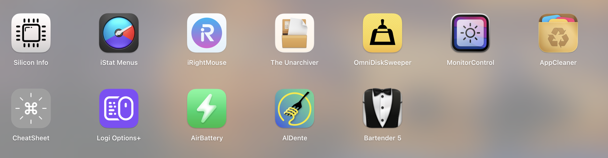
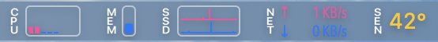
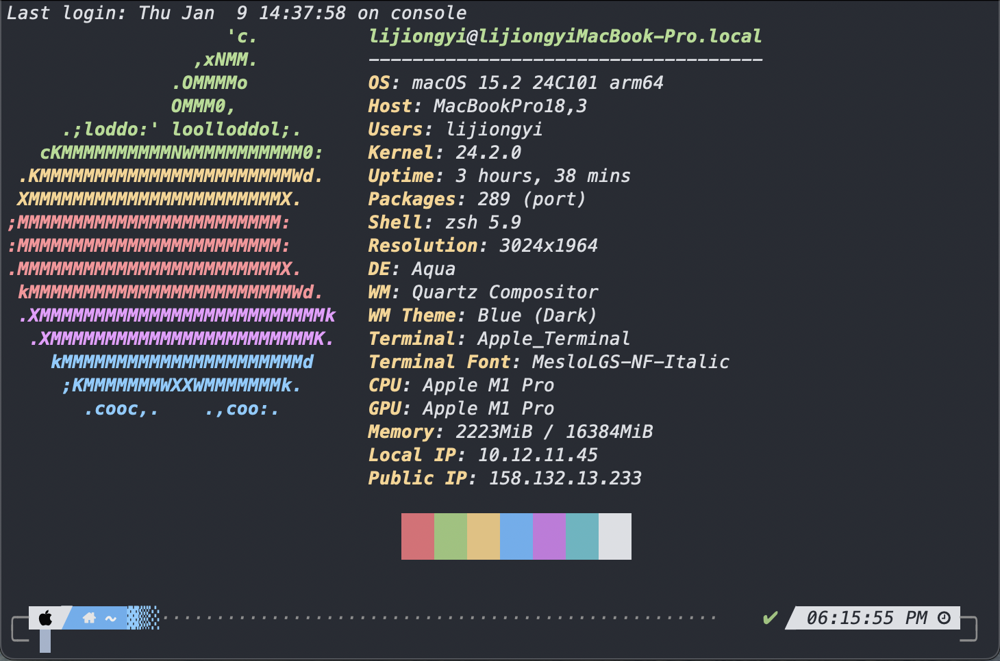

# macOS-workflow-optimization
记录一下关于macOS整个系统的配置和使用心得和想法

从2022年大一开始,我就将MacBook Pro 16+512g 作为我的主力学习和开发机,在此期间从零开始积累了相当多的macOS使用经验,这次来记录一下自己对整个系统的配置和优化,还有好用的软件的安装过程,以及作为计算机学生所需要的开发环境的一些基础配置.

作为Unix系统的分支,macOS的系统文件结构和Linux有很多相似之处,包括Unix command等命令也通用.

目录:
1 (常见)通用软件的下载安装
2 (个人喜好)拓展macOS的功能
3 系统和开发环境基本配置

1 常见软件下载安装

众所周知macOS也有App Store并且有大量软件上架,但是由于App Store的审核机制,很多软件功能并不齐全,所以如果软件有官网版本就在官网下载,后续删除也可以删除.注意在官网下载要在设置里修改允许其他来源的软件打开

a. 浏览器: Firefox, Chrome
如果平时没有特别的喜好,可以直接使用macOS自带的Safari,比其他的浏览器更加省电

个人喜爱更自由的浏览器,曾经平时使用Firefox作为主力,但是由于macOS的fiefox对红绿灯按钮UI适配一般,现在使用Chrome.
下载: 官网

b. 播放器:IINA
macOS兼容性比较好的一款播放器,比原生好用一些,并且开源免费,当然用原生也可以...
下载: 官网

c. 网页视频抓取: Downie 4
这个其实有开源的和chrome插件等可以实现类似的功能,但是我早期没有了解到...就直接买了这个软件,非常好用,把url copy进去就可以直接下载,还有很多自定义选项
下载: 官网,买断制

d. Office三件套
这个不用说,大家都多少会用到,macOS自带的同类三件套兼容性也不好
下载:App Store

e. 邮件客户端 Outlook
使用过一些其他的开源客户端,感觉还是outlook好一点,外观不那么简陋
下载: App Store

f. 社交软件
微信QQ等都有官网版本,也可以在App Store安装,我长期在HK,TG,WhatsApp等软件也是一样,自己找就好
下载: 官网, App Store

g. 录制 OBS
OBS相当出名了,非常好用,功能齐全,还有直播功能
下载: 官网

h. 娱乐
bilibili,steam,epic games都有mac原生arm版本, 也有相当多的游戏支持mac平台游玩.各种娱乐软件网上都有Mac版本
下载:App Store,官网

i. Windows系统
 MacBook转向arm架构后,已经无法再安装原生Windows了(这个感兴趣的话具体可以去查一查),所以如果要用Windows需要通过虚拟机
 目前主流虚拟机有parallel desktop(简称pd),vmware fusion等.其中性能pd最好,但是收费并且价格比较高,不找破解的话我是承担不起的qwq,而且我个人不太喜欢pd把所有的文件夹子冻共享的特性(也许是我没有研究设置?).目前主要用vmware fusion作为主力虚拟机客户端.具体安装教程网上有很多.还有utm,virtual box啥的也可以用, utm还能软件模拟x86☺️
 下载:官网

j. 文件共享和传输: Localsend
这个软件可以在局域网下各个设备互相传送文件,只要双方设备都安装它
对我来说绝对的神器. 开源,全平台支持,免费,简洁,性能开销小.
下载: App Store,官网

k. 代理 clashX Pro
各种代理客户端有不少,这个可以从GitHub上找到,比较经典的软件
下载: GitHub

2 macOS功能拓展和优化

在安装了平日里常用软件后, 需要对系统的默认配置进行一些修改,以及一些扩展软件,让系统有更多功能

这些是我目前安装的一些工具,用来提高效率或者使用电脑的舒适程度.现在一个一个来介绍

silicon info
目前苹果m芯片已经推出了好些年,大多数软件都原生适配了m芯片,但是还有些没有
这个就是用来查看当前app是原生适配还是apple rosetta转译

istatmenus

查看系统运行情况的软件.运行在菜单栏. 支持cpu,gpu,内存,硬盘等等几乎所有系统提供api可以查看到的数据.可以自定义外观

irightmouse
扩展macOS的鼠标右键功能,可以配制许多功能,包括快速创建指定类型的文件等.基本能涵盖日常大多数操作了.

The Unarchiver
解压缩软件,比自带的归档有更多的功能,并且比较简洁,完美融入系统

OmniDiskSweeper
硬盘空间分析软件,我个人喜好简洁满足功能需求的软件,这个可以查看每一层文件夹的大小,逐步了解空间占用情况,当然你不够了解文件属性的情况下最好别动它

MonitorControl
下载了还没用过... 这个可以控制外接屏幕的亮度,比你在显示器背后找按钮方便一点...

Appcleaner
有时候删除了应用本体还剩下一些配置文件等在系统里,可以用这个把删除软件剩下的残渣一起清除

CheatSheet
安装以后后台工作,长按command可以显示在当前页面下可以使用的快捷键,对于学习快捷键使用很有效

Logi Options+
bug很多并且比较臃肿但是不得不用, 其他开源的驱动适配的还是不如原生

Air Battery
显示设备电量的软件,可以在菜单栏也可以小组件,比系统自带的更全面一点,比如蓝牙设备的实时电量.

Aldente
维护电池健康, 比如可以将电池维持在80容量不变, pro版本支持了更多的功能

Bartender 5
扩展macOS的菜单栏,解决刘海屏占位置的问题

3 系统和开发环境基本配置

终端配置

安装neofetch,加入终端启动自动执行,有点仪式感...

包管理器: macport
曾经使用homebrew也就是macOS最热门的包管理器管理软件环境, 但是由于brew通常自动将包安装在系统opt目录下(也可能是我记错了qwq),
导致自动拥有管理员权限. 容易产生包的冲突问题,导致在一次冲突无法解决后我重装系统将包管理器换成了Macport, 一个老一些更新慢一些
但是为每个安装的包或者软件的环境隔离起来,虽然会重复下载依赖以及经常会编译下载的源码,但是至少环境再没有冲突了,macport也不会自动调用管理员权限.

终端主题: powerlevel10k
很有名的一个主题,从github上clone下来后按照官方给出的提示做就可以了.
效果图

zsh插件: 语法高亮和根据历史补全
同样也是clone github上的插件,在.zshrc中添加即可.
下面是我写的配置,

source ~/.zsh-syntax-highlighting/zsh-syntax-highlighting.zsh
# 自己添加的语法高亮插件

source ~/.zsh-autosuggestions/zsh-autosuggestions.zsh
# 自己添加的建议插件

ZSH_AUTOSUGGEST_HIGHLIGHT_STYLE="fg=yellow"
# 语法高亮的颜色

ZSH_HIGHLIGHT_STYLES[unknown-command]='fg=red'
# 语法未识别时的颜色

ps 我没有直接装oh my zsh这个东西和第三方终端,因为暂时用不到...并且oh my zsh有很多功能会拖慢终端启动速度,我也只需要两个插件即可

开发环境 

❯ python --version
Python 3.12.7

❯ java --version
java 17.0.12 2024-07-16 LTS
Java(TM) SE Runtime Environment (build 17.0.12+8-LTS-286)
Java HotSpot(TM) 64-Bit Server VM (build 17.0.12+8-LTS-286, mixed mode, sharing)

等等等等

本人还是个CTFer,主打web
列举下安装的工具:

file, dirsearch, binwalk, foremost软件包

stegsolve图片隐写工具, wireshark, burpsuite

剩下的用的具体看题目了,还有很多...